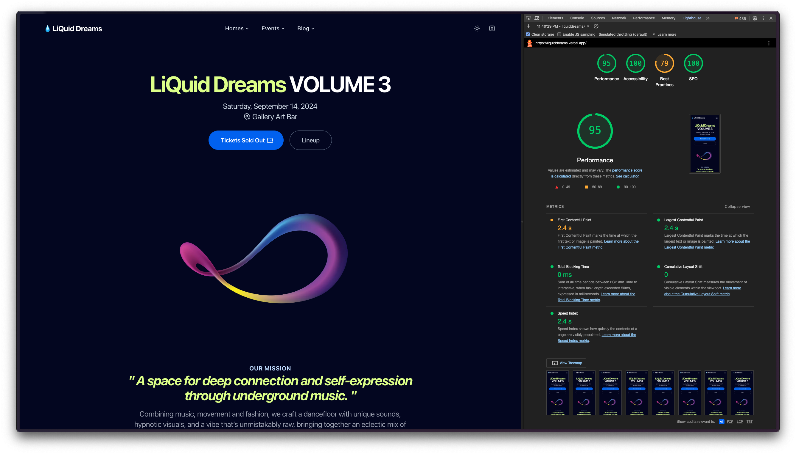

# LiQuid Dreams


## Lighthouse Scores



- 🟢 Performance: 95
- 🟢 Accessibility: 100
- 🟠 Best Practices: 79
- 🟢 SEO: 100
- ⚫️ Progressive Web App: N/A

## Site

View a live site of the [LiQuid Dreams's Page](http://liquiddreams.vercel.app) .

## Tech Stack

- [Astro](https://astro.build)
- [TypeScript](https://www.typescriptlang.org)
- [TailwindCSS](https://tailwindcss.com)
- [Tailwind-Merge](https://github.com/dcastil/tailwind-merge)
- [DaisyUI](https://daisyui.com)
- [MDX](https://mdxjs.com)

## Project Structure

```
.
├── public
│   ├── decapcms
│   │   ├── config.yml
│   │   └── index.html
│   ├── ics
│   │   └── event_liquid-dreams-volume-3.ics
│   ├── Images
│   │   ├── Banner-Liquid.Dreams.Lighthouse.jpg
│   │   └── Banner-Liquid.Dreams.jpg
│   ├── _headers
│   └── robots.txt
├── src
│   ├── assets
│   │   ├── favicons
│   │   │   ├── apple-touch-icon.png
│   │   │   ├── favicon.ico
│   │   │   └── favicon.svg
│   │   ├── images
│   │   │   ├── Artist_LiquidDreams_0x01000111.jpg
│   │   │   ├── Artist_LiquidDreams_Howz.jpg
│   │   │   ├── Artist_LiquidDreams_Norman.Hernandez.jpg
│   │   │   └── ...
│   │   └── styles
│   │       └── tailwind.css
│   ├── components
│   │   ├── CustomStyles.astro
│   │   ├── Favicons.astro
│   │   ├── Logo.astro
│   │   ├── blog
│   │   │   ├── Grid.astro
│   │   │   ├── GridItem.astro
│   │   │   ├── Headline.astro
│   │   │   └── ...
│   │   ├── common
│   │   │   ├── Analytics.astro
│   │   │   ├── ApplyColorMode.astro
│   │   │   ├── BasicScripts.astro
│   │   │   └── ...
│   │   ├── ui
│   │   │   ├── Background.astro
│   │   │   ├── Button.astro
│   │   │   ├── DListItem.astro
│   │   │   └── ...
│   │   └── widgets
│   │       ├── Announcement.astro
│   │       ├── BlogHighlightedPosts.astro
│   │       ├── BlogLatestPosts.astro
│   │       └── ...
│   ├── content
│   │   ├── post
│   │   │   ├── artist_0x01000111.mdx
│   │   │   ├── artist_Howz.mdx
│   │   │   ├── artist_Norman.Hernandez.mdx
│   │   │   └── ...
│   │   └── config.ts
│   ├── layouts
│   │   ├── LandingLayout.astro
│   │   ├── Layout.astro
│   │   ├── MarkdownLayout.astro
│   │   └── PageLayout.astro
│   ├── pages
│   │   ├── [...blog]
│   │   │   ├── [category]
│   │   │   │   └── [...page].astro
│   │   │   ├── [tag]
│   │   │   │   └── [...page].astro
│   │   │   ├── [...page].astro
│   │   │   └── index.astro
│   │   ├── events
│   │   │   └── liquid-dreams-volume-3.astro
│   │   ├── 404.astro
│   │   ├── index.astro
│   │   ├── privacy.md
│   │   ├── rss.xml.ts
│   │   └── terms.md
│   ├── utils
│   │   ├── blog.ts
│   │   ├── directories.ts
│   │   ├── frontmatter.mjs
│   │   ├── images-optimization.ts
│   │   ├── images.ts
│   │   ├── permalinks.ts
│   │   └── utils.ts
│   ├── config.yaml
│   ├── env.d.ts
│   ├── navigation.js
│   └── types.d.ts
├── vendor
│   └── integration
│       ├── utils
│       │   ├── configBuilder.ts
│       │   └── loadConfig.ts
│       ├── index.mjs
│       └── types.d.ts
├── astro.config.mjs
├── eslint.config.js
├── LICENSE.md
├── netlify.toml
├── package-lock.json
├── package.json
├── README.md
├── sandbox.config.json
├── tailwind.config.json
├── tsconfig.json
├── vercel.json
└── vscode.tailwind.json
```
## Commands

All commands are run from the root of the project, from a terminal :

| Command               | Action                                             |
| :-------------------- | :------------------------------------------------- |
| `npm install`         | Installs dependencies                              |
| `npm run dev`         | Starts local dev server at `localhost:4321`        |
| `npm run build`       | Build your production site to `./dist/`            |
| `npm run preview`     | Preview your build locally, before deploying       |
| `npm run format`      | Format codes with Prettier                         |
| `npm run lint:eslint` | Run Eslint                                         |
| `npm run astro ...`   | Run CLI commands like `astro add`, `astro preview` |

## Configuration

Basic configuration file: `./src/config.yaml`

```yaml
site:
  name: LiQuid Dreams
  site: 'https://liquiddreams.vercel.app'
  base: '/'
  trailingSlash: false # Generate permalinks with or without "/" at the end

  googleSiteVerificationId: orcPxI47GSa-cRvY11tUe6iGg2IO_RPvnA1q95iEM3M

# Default SEO metadata
metadata:
  title:
    default: LiQuid Dreams
    template: '%s — LiQuid Dreams'
  description: "A vibrant space for self-expression with unique music, hypnotic visuals, and emerging DJs from around the world."
  robots:
    index: true
    follow: true
  openGraph:
    site_name: LiQuid Dreams
    images:
      - url: '~/assets/images/Poster_LiquidDreams_Volume.3_Square.jpg'
        width: 800
        height: 800
    type: website
  twitter:
    handle: '@onwidget'
    site: '@onwidget'
    cardType: summary_large_image

i18n:
  language: en
  textDirection: ltr

apps:
  blog:
    isEnabled: true # If the blog will be enabled
    postsPerPage: 6 # Number of posts per page

    post:
      isEnabled: true
      permalink: '/%slug%' # Variables: %slug%, %year%, %month%, %day%, %hour%, %minute%, %second%, %category%
      robots:
        index: true

    list:
      isEnabled: true
      pathname: 'blog' # Blog main path, you can change this to "articles" (/articles)
      robots:
        index: true

    category:
      isEnabled: true
      pathname: 'category' # Category main path /category/some-category, you can change this to "group" (/group/some-category)
      robots:
        index: true

    tag:
      isEnabled: true
      pathname: 'tag' # Tag main path /tag/some-tag, you can change this to "topics" (/topics/some-category)
      robots:
        index: false

    isRelatedPostsEnabled: true # If a widget with related posts is to be displayed below each post
    relatedPostsCount: 4 # Number of related posts to display

analytics:
  vendors:
    googleAnalytics:
      id: null # or "G-XXXXXXXXXX"

ui:
  theme: 'system' # Values: "system" | "light" | "dark" | "light:only" | "dark:only"
```

#### Customize Design

To customize Font families, Colors or more Elements refer to the following files:

- `src/components/CustomStyles.astro`
- `src/assets/styles/tailwind.css`