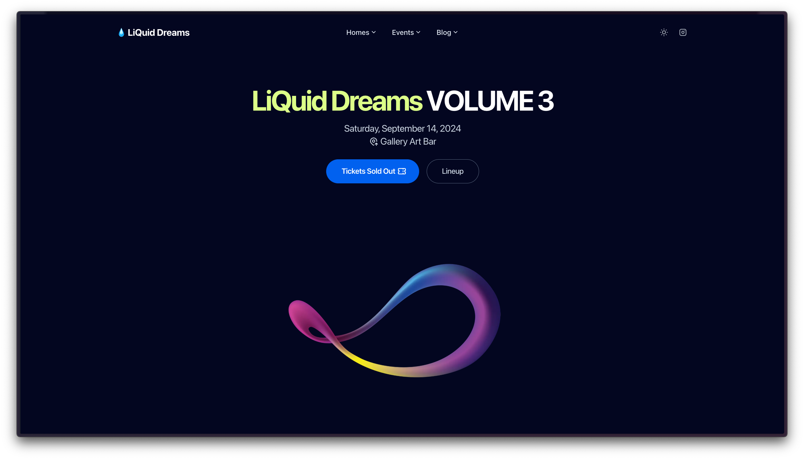

## `README.md` is being written at the moment : )



Project Structure

```
.
├── public
│   ├── decapcms
│   │   ├── config.yml
│   │   └── index.html
│   ├── ics
│   │   └── event_liquid-dreams-volume-3.ics
│   ├── _headers
│   └── robots.txt
├── src
│   ├── assets
│   │   ├── favicons
│   │   │   ├── apple-touch-icon.png
│   │   │   ├── favicon.ico
│   │   │   └── favicon.svg
│   │   ├── images
│   │   │   ├── Artist_LiquidDreams_0x01000111.jpg
│   │   │   ├── Artist_LiquidDreams_Howz.jpg
│   │   │   ├── Artist_LiquidDreams_Norman.Hernandez.jpg
│   │   │   └── ...
│   │   └── styles
│   │       └── tailwind.css
│   ├── components
│   │   ├── CustomStyles.astro
│   │   ├── Favicons.astro
│   │   ├── Logo.astro
│   │   ├── blog
│   │   │   ├── Grid.astro
│   │   │   ├── GridItem.astro
│   │   │   ├── Headline.astro
│   │   │   └── ...
│   │   ├── common
│   │   │   ├── Analytics.astro
│   │   │   ├── ApplyColorMode.astro
│   │   │   ├── BasicScripts.astro
│   │   │   └── ...
│   │   ├── ui
│   │   │   ├── Background.astro
│   │   │   ├── Button.astro
│   │   │   ├── DListItem.astro
│   │   │   └── ...
│   │   └── widgets
│   │       ├── Announcement.astro
│   │       ├── BlogHighlightedPosts.astro
│   │       ├── BlogLatestPosts.astro
│   │       └── ...
│   ├── content
│   │   ├── post
│   │   │   ├── artist_0x01000111.mdx
│   │   │   ├── artist_Howz.mdx
│   │   │   ├── artist_Norman.Hernandez.mdx
│   │   │   └── ...
│   │   └── config.ts
│   ├── layouts
│   │   ├── LandingLayout.astro
│   │   ├── Layout.astro
│   │   ├── MarkdownLayout.astro
│   │   └── PageLayout.astro
│   ├── pages
│   │   ├── [...blog]
│   │   │   ├── [category]
│   │   │   │   └── [...page].astro
│   │   │   ├── [tag]
│   │   │   │   └── [...page].astro
│   │   │   ├── [...page].astro
│   │   │   └── index.astro
│   │   ├── events
│   │   │   └── liquid-dreams-volume-3.astro
│   │   ├── 404.astro
│   │   ├── index.astro
│   │   ├── privacy.md
│   │   ├── rss.xml.ts
│   │   └── terms.md
│   ├── utils
│   │   ├── blog.ts
│   │   ├── directories.ts
│   │   ├── frontmatter.mjs
│   │   ├── images-optimization.ts
│   │   ├── images.ts
│   │   ├── permalinks.ts
│   │   └── utils.ts
│   ├── config.yaml
│   ├── env.d.ts
│   ├── navigation.js
│   └── types.d.ts
├── vendor
│   └── integration
│       ├── utils
│       │   ├── configBuilder.ts
│       │   └── loadConfig.ts
│       ├── index.mjs
│       └── types.d.ts
├── astro.config.mjs
├── eslint.config.js
├── LICENSE.md
├── netlify.toml
├── package-lock.json
├── package.json
├── README.md
├── sandbox.config.json
├── tailwind.config.json
├── tsconfig.json
├── vercel.json
└── vscode.tailwind.json
```
